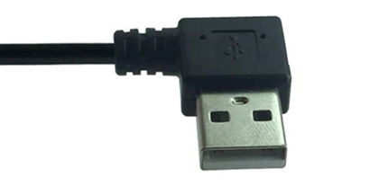
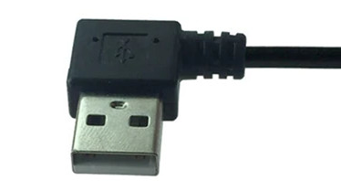

# WiModem232 to "Model T" portable computers

RS-232 male-male gender-changer for connecting a [WiModem232](https://www.cbmstuff.com/proddetail.php?prod=WiModem232OLED) to a TRS-80 Model 100, or any of the similar machines which has a female DB25 RS-232 DTE connector.

It does 3 things:
- Gender-changer. Both the WiModem232 and Model 100 and clones have female connectors. So a gender-changer or male-male cable is needed to connect them.
- Faces the WiModem232's status led and oled display towards the user. A standard mini gender-changer flips the WiModem232 over so it faces down.
- Holds the Wimodem232 vertical instead of horizontal. This just takes up less desk space and makes it less likely to knock the WiModem232 off of the serial port, and makes it a little easier to read the display from a normal position.

Wired straight-through, not null-modem. The WiModem232, like any other modem or peripheral, is wired as a DCE device, and the Model 100, like any other computer or host, is wired as a DTE device, and so to connect the two, you use a straight-through connection. The RS-232 pins; 1-8, 20, & 22, are connected 1:1 from one connector to the other.  
Pin 1 is also the ground plane / copper pour on both sides of the board.

# Compatibility  
This is for attaching the WiModem232 to any of these machines  
- TRS-80/Tandy Model 100, 200, & 600  
- NEC PC-8201, PC-8201a, & PC-8300  
- Kyocera/Kyotronic KC-85

But notably, NOT these  
- Tandy Model 102  
- Olivetti M10

On Tandy 102 & Olivetti M10 machines, the DB25 connector is upside down, and so this adapter would point the WiModem232 down into the table.

For Tandy 102 & Olivetti M10, you can use an ordinary [25-pin mini gender-changer](https://duckduckgo.com/?q=db25+mini+gender+changer+male), and the WiModem232 will point straight out from the back of the machine instead of standing vertical, and with the LED and OLED screen facing up.

This PCB is designed to use [db25 connectors with through-hole legs](https://www.digikey.com/short/z9nm2v), not solder cups.  

# Power from BCR port  
You can power the WiModem232 from the computer with this [BCR-USB-Power adapter](https://github.com/bkw777/BCR_USB_PWR)  
 and a usb cable.  
  

The different computer models need different usb cables to get the most tidy arrangement.  
The WiModem232 end of the cable is the same in all cases.  
The cable should be about 9 inches (250mm) long in all cases.  
The best computer-end of the cable is different for different computer models.  
|Computer Model|Computer End|WiModem232 End|Links|
|---|---|---|---|
| TANDY 100 & 200 |  |  | <https://www.aliexpress.com/item/4000924923480.html> Color: Right,  Length: 25cm |
| TANDY 102 & Olivetti M10 |  |  | <https://www.aliexpress.com/item/32404719272.html> Color: 3,  USB-A-Right USB-Mini-Right |
| NEC PC-8201, PC-8201a, & PC-8300 |  |  | <https://www.aliexpress.com/item/32404719272.html> Color: 4,  USB-A-Left USB-Mini-Right |  
